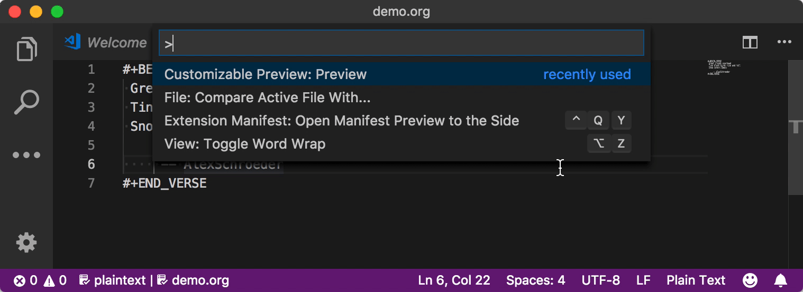

# Customizable Preview

Customizable Preview is a Visual Studio Code Extension to custom preview for any file.



## Features

* Support HTML preview by default
* Easy to integrate the external tools (e.g. [Pandoc](https://pandoc.org), [CommonMark](https://github.com/commonmark/CommonMark/wiki/List-of-CommonMark-Implementations), [Graphviz](http://www.graphviz.org))

## Installation

Open the [Quick Open](https://code.visualstudio.com/docs/getstarted/tips-and-tricks#_quick-open), and execute the below command, then restart Visual Studio Code

```
ext install eugnma.vscode-customizable-preview
```

## Usage

Open the [Command Palette](https://code.visualstudio.com/docs/getstarted/userinterface#_command-palette), and select the **Customizable Preview: Preview**

## Extension Settings

This extension contributes the following settings:

* `customizablePreview.rules`: Specifies the custom rules, below is a sample for Org-mode preview
    ```js
    [
        {
            // Optional, rule group name, it can only contains alphabets,
            // digits, underscores and any of the following characters: '.',
            // ' ', '-', in addition only alphabets and digits can be at the
            // beginning and the end
            "groupName": "",

            // Mandatory, rule name, it can only contains alphabets, digits,
            // underscores and any of the following characters: '.', ' ', '-',
            // in addition only alphabets and digits can be at the beginning
            // and the end
            "name": "Org-mode",

            // Optional, rule description
            "description": "Org-mode Preview",

            // Mandatory, the function in string tests whether the rule should
            // be applied.
            // You can see below input parameter section for more details
            "test": "x => x.languageId == 'org' || x.extname == '.org'",

            // Mandatory, the external command, it uses the default behaviour
            // reads input from stdin, and output goes to stdout.
            // A command can be a string command, a function command, a plain object command.
            // A string command (e.g. stringCommand) equals to a function command:
            //   x => stringCommand
            // A single command (e.g. singleCommand) equals to a plain object command:
            //   {
            //     saved: singleCommand,
            //     unsaved: singleCommand
            //   },
            // The saved or unsaved properties specify a file is saved or not.
            // You can see below input parameter section for more details
            "command": "pandoc --from org --to html",

            // Optional, indicates whether to directly show the result from
            // command, false to put the result in HTML body section by default
            "directFromCommand": true
        },
        /*
        Other rules, if a rule has the same group name and name with previous
        rule, it will override previous one
        .
        .
        .
        */
    ]
    ```
* The file info of previewing file is the input parameter of the functions from settings, below is a sample
    ```js
    {
        languageId: "org", // The language ID
        filename: "/tmp/demo.org", // The filename with full path
        extname: ".org", // The file extension
        dirname: "/tmp", // The directory name of the file path
        isUntitled: false, // Indicates a file is untitled or not
        text: "demo" // The content
    }
    ```

## Change Log

See CHANGELOG [here](CHANGELOG.md)

### For more information

* [CommonMark](https://commonmark.org)
* [Org mode](https://orgmode.org)
* [Standard streams](https://en.wikipedia.org/wiki/Standard_streams)
